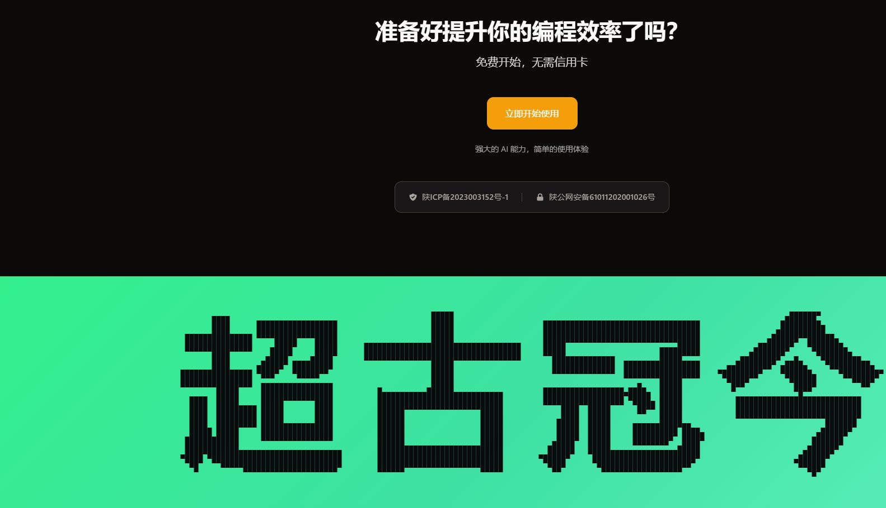

# 交互式中文字符粒子分解动画 | Interactive Chinese Character Particle Animation

一个基于HTML5 Canvas技术开发的创新性中文字符交互动画项目，展示"超古冠今"四个汉字的动态粒子分解效果。当鼠标悬停或触摸字符时，文字会实时分解为数百个像素粒子，营造出令人惊艳的视觉冲击效果。

An innovative Chinese character interactive animation project built with HTML5 Canvas technology, showcasing dynamic particle decomposition effects for the four Chinese characters "超古冠今" (Transcending Ancient and Modern). Characters decompose into hundreds of pixel particles in real-time when hovered or touched, creating stunning visual impact.



## ✨ 核心特性 | Key Features

- **🎨 实时粒子分解 | Real-time Particle Decomposition**
  鼠标接触时字符瞬间分解为像素粒子，支持磁吸效果
  Characters instantly break into pixel particles on mouse contact with magnetic attraction effects

- **⚡ 智能重组动画 | Intelligent Reassembly Animation**
  鼠标移开后粒子自动重新聚合还原字符
  Particles automatically reaggregate to restore characters when mouse moves away

- **🎯 精准像素检测 | Precise Pixel Detection**
  基于Canvas像素级检测，支持复杂汉字结构
  Canvas pixel-level detection supporting complex Chinese character structures

- **📱 响应式设计 | Responsive Design**
  完美适配桌面端和移动端设备
  Perfect adaptation for both desktop and mobile devices

- **🚀 性能优化 | Performance Optimized**
  高效渲染算法，支持高刷新率显示器
  Efficient rendering algorithms supporting high refresh rate displays

## 🎮 在线演示 | Live Demo

**体验地址 | Demo URL**: [https://claude.a520a.cn/](https://claude.a520a.cn/)

> 💡 **使用说明 | How to Use**: 访问网站并滑动到页面底部即可体验完整的交互效果
> Visit the website and scroll to the bottom of the page to experience the full interactive effect

## 🛠️ 技术实现 | Technical Implementation

### 前端技术栈 | Frontend Stack
- **核心技术 | Core**: 纯原生JavaScript + HTML5 Canvas | Pure vanilla JavaScript + HTML5 Canvas
- **动画引擎 | Animation**: requestAnimationFrame 优化的60fps流畅动画 | 60fps smooth animations
- **像素处理 | Pixel Processing**: Canvas ImageData API实现字符像素提取 | Character pixel extraction
- **交互检测 | Interaction**: 实时鼠标位置追踪和碰撞检测 | Real-time mouse tracking and collision detection
- **渲染优化 | Rendering**: devicePixelRatio适配高DPI显示设备 | High-DPI display adaptation

### 核心算法 | Core Algorithms
1. **字符像素化 | Character Pixelization**: 将汉字转换为像素点阵数据
2. **粒子物理 | Particle Physics**: 模拟粒子的分解、飞散和重组行为
3. **磁场效应 | Magnetic Field**: 鼠标周围的引力和斥力场计算
4. **性能优化 | Performance**: 像素采样和渲染优化算法

## 📐 项目结构 | Project Structure

```
particle-text-effect/
├── index.html              # 主页面 | Main page
├── css/styles.css          # 样式文件 | Stylesheets
├── js/touch-distortion.js  # 核心交互逻辑 | Core interaction logic
├── .gitignore             # Git忽略配置 | Git ignore configuration
└── README.md              # 项目说明 | Project documentation
```

## 🎨 设计理念 | Design Philosophy

这个项目将传统中国文字艺术与现代数字技术完美融合，通过交互式的粒子分解效果，展现了汉字"超古冠今"的深刻寓意——既传承古典文化精髓，又拥抱现代科技创新。

This project perfectly combines traditional Chinese calligraphy art with modern digital technology. Through interactive particle decomposition effects, it demonstrates the profound meaning of the Chinese characters "超古冠今" - inheriting the essence of classical culture while embracing modern technological innovation.

## 🚀 快速开始 | Quick Start

### 本地运行 | Local Development

```bash
# 克隆项目 | Clone repository
git clone https://github.com/beiming824723/particle-text-effect.git

# 进入目录 | Enter directory
cd particle-text-effect

# 使用任意HTTP服务器启动 | Start with any HTTP server
# 方式1: Python
python -m http.server 8000

# 方式2: Node.js
npx serve .

# 方式3: 直接打开 | Direct open
# 直接在浏览器中打开 index.html
```

### 部署 | Deployment

项目为纯静态页面，可直接部署到任何静态托管服务：
- GitHub Pages
- Vercel
- Netlify
- 云服务器

This is a pure static project that can be deployed to any static hosting service.

## 📱 浏览器兼容性 | Browser Compatibility

- ✅ Chrome 60+
- ✅ Firefox 55+
- ✅ Safari 12+
- ✅ Edge 79+
- ✅ 移动端浏览器 | Mobile browsers

## 📄 开源协议 | License

本项目采用 [Apache License 2.0](LICENSE) 开源协议
This project is licensed under the [Apache License 2.0](LICENSE)

## 🤝 贡献指南 | Contributing

欢迎提交 Issue 和 Pull Request 来改进这个项目！
Issues and Pull Requests are welcome to improve this project!

## 📞 联系方式 | Contact

如有问题或建议，请通过 GitHub Issues 联系我们。
For questions or suggestions, please contact us through GitHub Issues.

---

⭐ 如果这个项目对你有帮助，请给它一个星标！
⭐ If this project helps you, please give it a star!